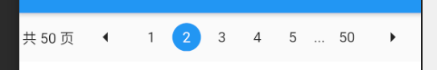
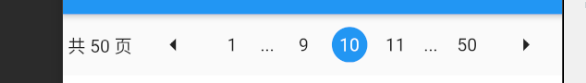

# ly_page_indicator

Page indicator.

  
  



## Getting Started

1. 在 `pubspec.yaml` 中添加依赖

```
dependencies:
  uhf_plugin:
    git:
      url: https://gitee.com/toptower-iot/booher.smq.plugin.flutter.git
```